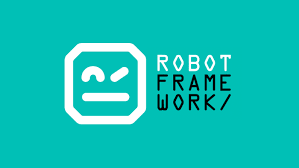

# The Originals Front 
Projeto de automação Web com o ```Robot Framework```.

 
Projeto voluntário supervisionado pela Qa.Coders para Testes de Frontend executado pela equipe The Originals.
 
## Instalação
 
*Instalando o Python*
 
[Python](https://python.org.br/instalacao-windows/)
 
*Instalando o Pip*
 
```bash

  pip -m pip install --upgrade pip

  pip -m pip --version

```
 
*Instalando as tecnologias e libs necessárias do projeto*
 
[Instalação do Robot](https://robotframework.org/?tab=1#getting-started)
 
```bash

  pip install robotframework

```
 
*Demais Libraries para os testes de Frontend*
 
```bash

pip install --upgrade robotframework-seleniumlibrary

```
 
Para validar todas as instalações
 
```bash

  pip list

  pip freeze

```
 
Criar requirements.txt com as
 
## Stacks utilizada
 
**Libraries**: Builtin, SeleniumLibrary, Collections, String, RequestsLibrary
 
**Automação:** Robot Framework
 
<!-- **Shell**: Shell Script -->
 
## Rodando localmente
 
Clone o projeto:
 
```bash

  git clone  https://github.com/rpatricia/theoriginals-academy-front-robot.git

```
 
Entre no diretório do projeto
 
```bash

  cd theoriginals-academy-front-robot

```

Para rodar os testes, rode o seguinte comando
 
```bash

  robot -d ./reports /tests

```
 
## Equipe
 
- [@brunabrito](https://github.com/?)

- [@lucianosirio](https://github.com/lucianosirio)

- [@rpatricia](https://github.com/rpatricia)

 